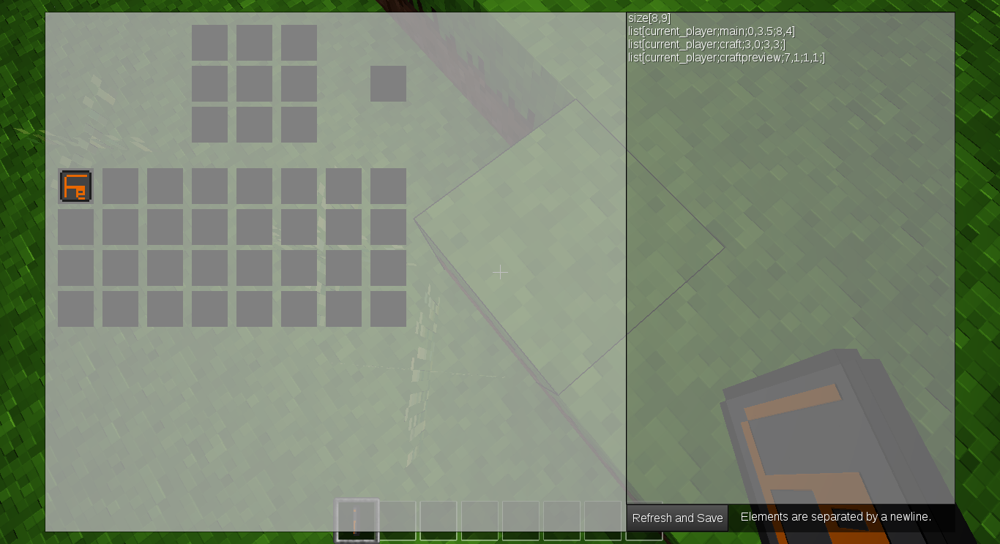

# Formspec Editor
The formspec editor is a very simple tool for the purpose of making formspec creation easier. Traditionally, you would have to reload Minetest every time you made the smallest change. However, with this formspec editor, simply put your formspec in the textarea, click refresh, and the formspec will be displayed on the right.

The formspec editor can be accessed in two ways. You can get the "Formspec Editor" item in the creative inventory or with `/giveme debugger:form_editor`, then left-click to edit or right-click to preview the form without the editor interface. You can also use the chatcommand `/form_editor` to access the editor. This command requires that you have the `debug` privilege. Providing no parameters or `edit` will show the editor, while `preview` will show the form without the editor interface.