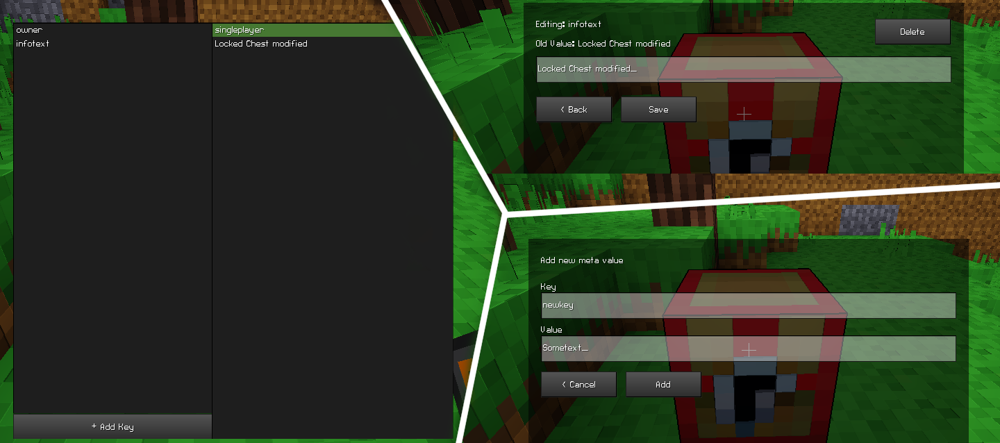

# Metadata Editor
The metadata editor is a slightly more complex tool that allows viewing and modifying the metadata of any node.

The metadata editor can only be accessed with the "Meta Editor" item in the creative inventory or with `/giveme debugger:meta_editor`. The interface can then be shown by punching any valid node.

In initial state, the editor displays a list of meta keys and their corresponding values. Double-clicking on any of the values allows you to assign a new value or delete the key-value pair entirely. You can also add new metadata fields with the "Add Key" bottom in the bottom-left corner of the initial state. __Note:__ Trying to add an existing key will result in an error message being printed to the chat.